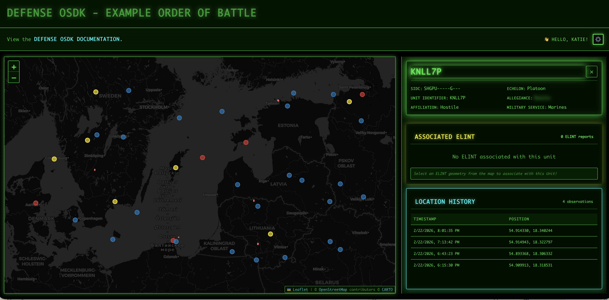

# [React] Defense OSDK Example



### Try It Out!
This application demonstrates how to use Palantir's Defense OSDK in React (Typescript).

To try this yourself, navigate to the **Developer Console** application in your Foundry enrollment.  You will need to make an **unscoped public OAuth client**.  To do this: 
* Select "New Application" in the top-right and name the application "OSDK Foo" 
  * If you use another name, you will need to update the npm library referenced in `package.json`.
* On the "Application type" screen, select "Client-facing application" 
* On the "Permissions" screen, be sure to select the "Autofill for me" box at the bottom of the page to autofill the redirect URL with http://localhost:8080/auth/callback.

Once the client is created:
* Navigate to the OAuth & Scopes tab and select "Unscoped" under Application Scopes
  * This means your application users will be able to see all resources they can see in platform. 
* Navigate to the Ontology SDK tab and add resources to generate SDKs and documentation from the [Defense OSDK Interfaces](https://www.palantir.com/docs/defense-osdk/api)
* After saving those Ontology resources, switch to the "SDK Versions" tab and generate an SDK for `npm`.
* Copy the client ID from the "OAuth & permissions" tab and use in the next step.

<br>

Next, create a `.env` file at the project folder target-api-react/ and populate it with:

    VITE_FOUNDRY_CLIENT_ID=<client id>
    VITE_FOUNDRY_REDIRECT_URL=http://localhost:8080/auth/callback
    VITE_FOUNDRY_API_URL=https://<foundry hostname>

Now we can install dependencies and run the application via `npm install`.  The output should look something like this:
```
➜  defense-osdk-demo git:(develop) ✗ npm install

up to date, audited 371 packages in 703ms

54 packages are looking for funding
  run `npm fund` for details

1 moderate severity vulnerability

To address all issues, run:
  npm audit fix

Run `npm audit` for details.
```
Now, you can run the project via `npm run dev` which will give you an output that looks like:
```
➜  defense-osdk-demo git:(develop) ✗ npm run dev

> defense-osdk-demo@0.0.0 dev


  VITE v5.2.13  ready in 101 ms

  ➜  Local:   http://localhost:8080/
  ➜  Network: use --host to expose
  ➜  press h + enter to show help
```
Click the [localhost](http://localhost:8080/) link to access the application!

## Themes
This project has a few different themes! Check them out in `src/_variables.scss`. You can toggle between the themes using the gear icon in the top right. 


## Dependencies
This project uses Palantir OSDK, which is licensed under the Apache License 2.0.
See http://www.apache.org/licenses/LICENSE-2.0 for details.

This project uses Leaflet, which is licensed under the BSD-2-Clause License.
See https://github.com/Leaflet/Leaflet/blob/main/LICENSE for details.


